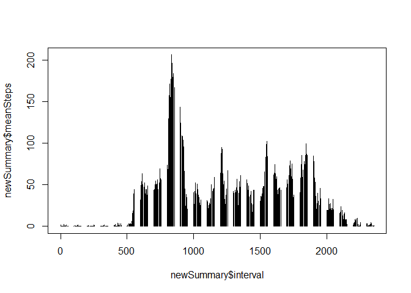

# Reproducible Research: Peer Assessment 1
## Loading libraries
 

```r
library (plyr)
```

```
## Warning: package 'plyr' was built under R version 3.1.3
```

```r
library (lattice)
```

## Loading and preprocessing the data

Loading the Activity.csv data provided for the assignment.


```r
 data <- read.csv("activity.csv")
 str(data)
```

```
## 'data.frame':	17568 obs. of  3 variables:
##  $ steps   : int  NA NA NA NA NA NA NA NA NA NA ...
##  $ date    : Factor w/ 61 levels "2012-10-01","2012-10-02",..: 1 1 1 1 1 1 1 1 1 1 ...
##  $ interval: int  0 5 10 15 20 25 30 35 40 45 ...
```

Data looks clean for now. Data will be formatted as required in future steps

## What is mean total number of steps taken per day?

Making a histogram of the total number of steps taken each day

```r
totalSteps <- tapply(data$steps, data$date, sum)
hist(totalSteps, breaks = 10)
```

 

Calculating the mean and median total number of steps taken per day

```r
mean(totalSteps, na.rm = TRUE)
```

```
## [1] 10766.19
```

```r
median(totalSteps, na.rm = TRUE)
```

```
## [1] 10765
```


## What is the average daily activity pattern?

Making a time series plot (i.e. type = "l") of the 5-minute interval (x-axis) and the average number of steps taken, averaged across all days (y-axis)

```r
summarizedData <- ddply (data, .(interval), summarize, meanSteps = mean(steps, na.rm=TRUE))
 plot(summarizedData$interval, summarizedData$meanSteps, type ='l')
```

 

Calculating Which 5-minute interval, on average across all the days in the dataset, contains the maximum number of steps.

```r
maxInterval <- summarizedData[summarizedData$meanSteps==max(summarizedData$meanSteps),]
maxInterval
```

```
##     interval meanSteps
## 104      835  206.1698
```

Answer: 835


## Imputing missing values

Calculating the total number of missing values in the dataset (i.e. the total number of rows with NAs)

```r
sum(is.na(data$steps))
```

```
## [1] 2304
```
Strategy for filling in all of the missing values in the dataset:

The strategy is to use  the mean for that 5-minute interval and Creating  a new dataset that is equal to the original dataset but with the missing data filled in.

```r
newData <- data
newData$steps[is.na(newData$steps)] <- tapply(X=data$steps,INDEX=data$interval,FUN=mean,na.rm=TRUE)
head(newData)
```

```
##       steps       date interval
## 1 1.7169811 2012-10-01        0
## 2 0.3396226 2012-10-01        5
## 3 0.1320755 2012-10-01       10
## 4 0.1509434 2012-10-01       15
## 5 0.0754717 2012-10-01       20
## 6 2.0943396 2012-10-01       25
```
Making a histogram of the total number of steps taken each day and Calculating the mean and median total number of steps taken per day, to illustrate the difference w.r.t original dataa

```r
 newSummary <- ddply (newData, .(interval), summarize, meanSteps = mean(steps, na.rm=TRUE))
plot(newSummary$interval, newSummary$meanSteps, type ='h')
```

 

```r
summary(newSummary)
```

```
##     interval        meanSteps      
##  Min.   :   0.0   Min.   :  0.000  
##  1st Qu.: 588.8   1st Qu.:  2.486  
##  Median :1177.5   Median : 34.113  
##  Mean   :1177.5   Mean   : 37.383  
##  3rd Qu.:1766.2   3rd Qu.: 52.835  
##  Max.   :2355.0   Max.   :206.170
```


## Are there differences in activity patterns between weekdays and weekends?
Creating a new factor variable in the dataset with two levels -- "weekday" and "weekend" indicating whether a given date is a weekday or weekend day.


```r
days <- weekdays(as.Date(newData$date) )
newData$dayTypes <- factor (days, levels <- c ('weekday', 'weekend'))
newData$dayTypes[] <- 'weekday'
 newData$dayTypes[days %in% c ('Saturday', 'Sunday')] <- 'weekend'
 patternSummary  <- ddply (newData,.(interval, dayTypes),  summarize,                           stepMean = mean(steps, na.rm=TRUE))
```


Making a panel plot containing a time series plot (i.e. type = "l") of the 5-minute interval (x-axis) and the average number of steps taken, averaged across all weekday days or weekend days (y-axis). The plot should look something like the following, which was created using simulated data:


```r
xyplot (stepMean ~ interval | dayTypes, 
      data=patternSummary,
         type='l',
       layout=c (1, 2))
```

 

